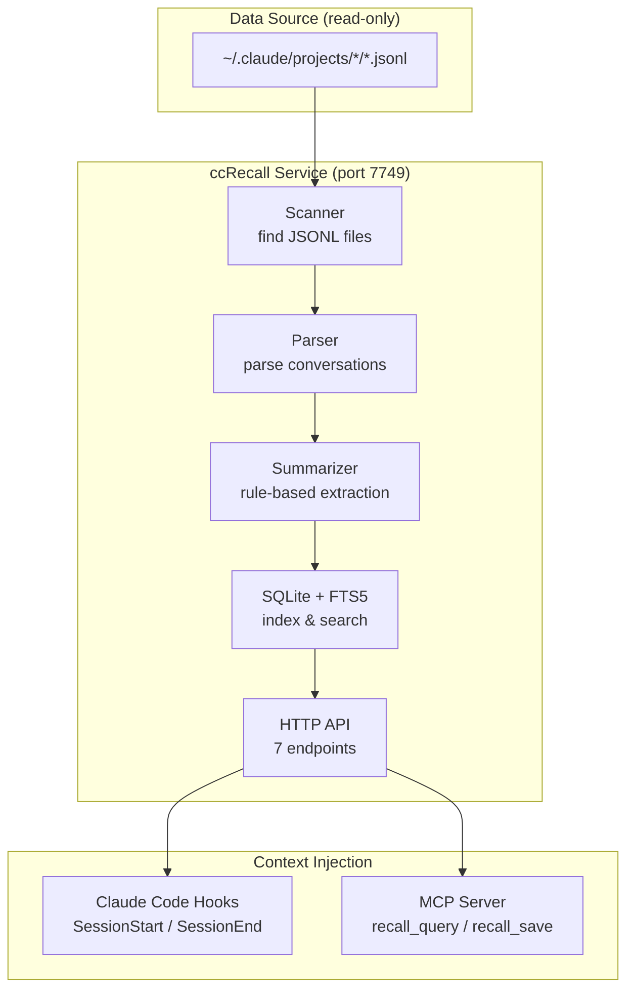

# ccRecall

[](https://opensource.org/licenses/Apache-2.0)
[](https://www.typescriptlang.org/)
[](https://nodejs.org/)
[](https://www.sqlite.org/)

[中文版](README_ZH.md)

A local memory service for Claude Code — indexes your conversation history, recalls relevant context on demand, and injects it into future sessions. Zero API cost.

---

## Core Concept

Every time you start a new Claude Code session, the AI forgets everything. The architecture you spent 20 minutes explaining, the bug you debugged together, the decisions you made — all gone. You start over.

CLAUDE.md and RESUME.md help, but they're static files you maintain by hand. ccRecall automates this: it reads your JSONL conversation logs, builds a searchable index, and serves relevant memories back to Claude Code through hooks and MCP tools. The AI remembers what it learned — you don't have to remind it.

ccRecall is the "memory" counterpart to [ccRewind](https://github.com/user/ccRewind) (a conversation replay GUI). ccRewind lets humans look back at what happened; ccRecall lets the AI remember what happened.

---

## Features

| Feature | Description |
|---------|-------------|
| **Rule-based summarization** | Extracts intent, activity, outcome, and tags from sessions — no LLM calls, zero API cost |
| **FTS5 full-text search** | Sub-100ms keyword search across all conversation history, fast enough for hook injection |
| **Incremental indexing** | Only re-indexes sessions that changed (mtime diffing), handles resumed sessions via UUID dedup |
| **Metacognition** | Knowledge map tracks what topics the AI has explored, at what depth, with what confidence |
| **Forgetting curve** | Memories compress over time: raw → summary → one-liner → deleted. Confidence decays on unused memories |
| **Read-only** | Never modifies `~/.claude/` — only reads JSONL logs |

---

## Architecture



---

## Tech Stack

| Technology | Purpose | Notes |
|------------|---------|-------|
| Node.js 22 + TypeScript | Runtime | ES modules, strict mode |
| better-sqlite3 | Database | Synchronous API, zero external deps |
| FTS5 | Full-text search | Built into SQLite, unicode61 tokenizer |
| Native `http` | HTTP server | No Express — minimal surface, localhost only |
| vitest | Testing | 207 tests across 10 files, integration-style |
| `@modelcontextprotocol/sdk` | MCP server | stdio transport, shared SQLite via WAL |

---

## Quick Start

### Prerequisites

- Node.js 20+ (recommended: 22)
- pnpm

### Installation

```bash
git clone https://github.com/user/ccRecall.git
cd ccRecall

pnpm install

# Start development server (auto-indexes on startup)
pnpm dev
```

The service starts at `http://127.0.0.1:7749` and indexes all JSONL files in `~/.claude/projects/`.

### Verify

```bash
# Health check — should show sessionCount > 0
curl http://127.0.0.1:7749/health

# Search your conversation history
curl "http://127.0.0.1:7749/memory/query?q=authentication&limit=5"
```

---

## API Endpoints

| Endpoint | Method | Description | Status |
|----------|--------|-------------|--------|
| `/health` | GET | Service health + DB stats | Live |
| `/memory/query?q=...&limit=...&project=...` | GET | FTS5 search across memories with optional project filter | Live |
| `/memory/save` | POST | Save a memory entry (origin-checked) | Live |
| `/session/end` | POST | Harvest a finished session's summary into a memory (idempotent) | Live |
| `/memory/context?session_id=...` | GET | Session context lookup | Stub |
| `/metacognition/check?topic=...` | GET | Knowledge depth check | Stub (Phase 3) |
| `/session/checkpoint` | POST | Pre-compact checkpoint | Stub (Phase 3) |

## MCP Tools

| Tool | Purpose |
|------|---------|
| `recall_query` | Search past decisions, discoveries, patterns via FTS5 |
| `recall_save` | Store a new memory (type: decision / discovery / preference / pattern / feedback) |

Expose them to Claude Code:

```bash
claude mcp add ccrecall --scope user -- /absolute/path/to/ccRecall/node_modules/.bin/tsx /absolute/path/to/ccRecall/src/mcp/server.ts
```

See [hooks/README.md](hooks/README.md) for SessionStart / SessionEnd hook installation.

---

## Project Structure

```
ccRecall/
├── src/
│   ├── core/
│   │   ├── types.ts          # All type definitions
│   │   ├── parser.ts          # JSONL conversation parser
│   │   ├── scanner.ts         # File system scanner
│   │   ├── summarizer.ts      # Rule-based session summarizer
│   │   ├── database.ts        # SQLite + FTS5 (trimmed from ccRewind)
│   │   ├── indexer.ts         # Indexing pipeline orchestrator
│   │   └── index.ts           # Barrel exports
│   ├── api/
│   │   ├── server.ts          # HTTP server
│   │   └── routes.ts          # Request routing + harvest flow
│   ├── mcp/
│   │   ├── server.ts          # MCP stdio server entry
│   │   └── tools.ts           # recall_query + recall_save
│   └── index.ts               # HTTP entry point
├── hooks/
│   ├── session-start.mjs      # Inject memories on SessionStart (stdout)
│   ├── session-end.mjs        # POST /session/end on SessionEnd
│   └── README.md              # Hook installation guide
├── tests/                     # 207 tests across parser / scanner /
│   │                          # summarizer / database / indexer / e2e /
│   │                          # memories / mcp / session-end /
│   │                          # hooks-session-start / hooks-session-end
│   └── fixtures/              # Sample JSONL files
└── .claude/
    └── pi-research/           # Architecture research documents
```

---

## Related Projects

- **[ccRewind](https://github.com/user/ccRewind)** — Session replay GUI for Claude Code. ccRecall's core modules (parser, scanner, summarizer, database, indexer) were extracted from ccRewind.

---

## Reflections

### Why This Exists

Thariq from Anthropic's Claude Code team [wrote about context management](https://x.com/trq212) in April 2026 — 11,908 bookmarks, because everyone saved it to re-read but nobody had the tools to actually do it. He described the problem perfectly: context rot degrades model performance in long sessions, and autocompact fires at the worst possible moment.

But he gave methodology, not tools. ccRecall is the tool.

The real trigger was simpler: I kept re-explaining the same architecture to Claude Code across sessions. Not because the AI is bad at remembering — it literally can't. Every session starts from zero. CLAUDE.md helps, but it's a static file I maintain by hand. The maintenance cost grows faster than the value. Sound familiar? That's exactly why humans abandon wikis too (Karpathy's LLM Wiki insight).

### Design Decisions

**Rule-based summarizer instead of LLM calls.** claude-mem uses the Claude API for summarization — you're paying AI money to help AI remember. ccRecall uses heuristic extraction (regex patterns, tool usage analysis, outcome inference). It's less sophisticated but costs exactly zero. For session summaries, "Edit x8, 5 files, committed" is more useful than a paragraph of prose anyway.

**FTS5 instead of vector database.** Semantic search sounds better on paper, but for conversation logs — where you're searching for specific tools, file paths, error messages — keyword matching wins. FTS5 queries run in <10ms locally. No embedding model, no Chroma, no Docker container. At the scale we're operating (hundreds of sessions, not millions of documents), Karpathy's own analysis confirms: "plain index + keyword search is already sufficient under 500 sources."

**HTTP + MCP dual interface.** Research showed that MCP server tools are the most stable way to inject context into Claude (pull-based, Claude decides when to fetch). But SessionStart hooks (push-based, automatic) are also stable. So ccRecall runs both: HTTP for hooks, MCP for on-demand queries. Same SQLite backend, two access patterns.

**Read-only constraint.** ccRecall never modifies `~/.claude/`. This isn't just politeness — it's a trust boundary. If a background service can write to your Claude Code config, one bug could corrupt your sessions. Read-only means the worst case is "ccRecall gives bad search results," not "ccRecall broke my setup."

### Non-goals

**No Docker, no Electron, no vector database.** These are deliberate exclusions, not missing features. Docker adds deployment friction for what should be a `pnpm dev` experience. Electron is for GUIs — ccRecall has no UI (that's ccRewind's job). Vector databases solve a problem we don't have at this scale.

**No LLM dependency for any operation.** If ccRecall needs an API key to function, it has failed. The whole point is zero-cost memory that runs locally. Summarization is rule-based. Search is FTS5. The day we need LLM calls is the day we've overscoped.

**No "smart" memory injection.** ccRecall doesn't decide what Claude should remember. It provides a search API — the injection layer (hooks, MCP) presents results, and Claude integrates them. Opinionated memory selection is a premature optimization that would be wrong in ways we can't predict.

**No modification of user data.** ccRecall reads `~/.claude/projects/` JSONL files. It never writes to that directory, never modifies session files, never injects itself into Claude Code's config automatically. The user explicitly configures hooks and MCP — ccRecall doesn't install itself.

---

## License

Licensed under the Apache License, Version 2.0 — see [LICENSE](LICENSE).

Copyright 2026 tznthou

---

## Author

tznthou - [tznthou@gmail.com](mailto:tznthou@gmail.com)
