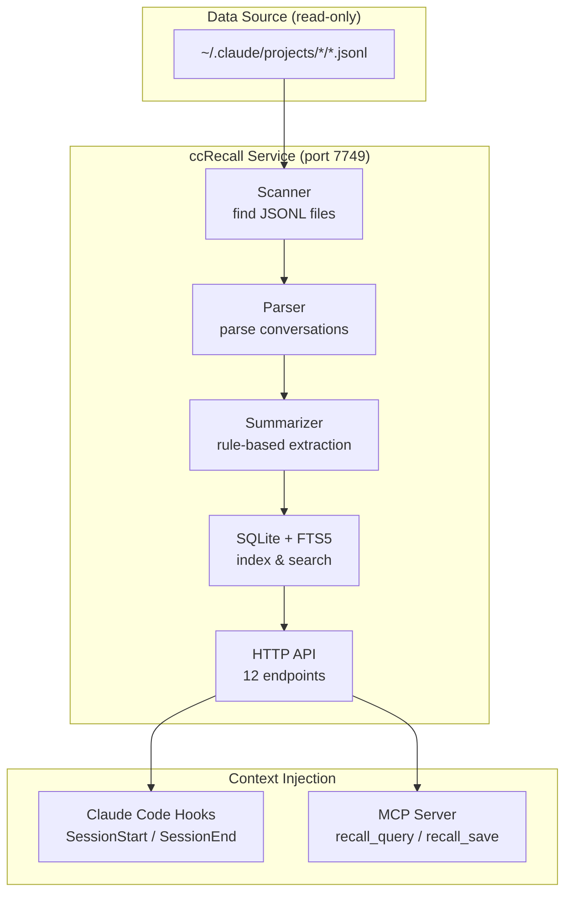

# ccRecall

[](https://opensource.org/licenses/Apache-2.0)
[](https://www.typescriptlang.org/)
[](https://nodejs.org/)
[](https://www.sqlite.org/)

[中文版](README_ZH.md)

A local memory service for Claude Code — indexes your conversation history, recalls relevant context on demand, and injects it into future sessions. Zero API cost for the core service; optional post-session extraction via Haiku adds ~$0.001/session.

---

> 📐 **v0.3.0 — Trust split (breaking change for harvest write path)**
>
> The SessionEnd hook now writes to a low-trust `session_journal` table instead of `memories`. Journal entries are scored, surfaced via `/health` (`journalPendingCount`), and **do not appear in `recall_query` / `recall_context` results** until you run `ccmem promote <id>`. Manual `recall_save` is unchanged — it still writes directly to high-trust `memories`.
>
> The rule scorer is no longer on the persistence gate; it informs trust grade and promotion priority instead. Background reasoning at [issue #21](https://github.com/tznthou/ccRecall/issues/21).
>
> Pre-0.3.0 memories stay queryable as-is. The v22 schema migration runs automatically on first daemon startup; existing rows are not touched. New harvest goes to journal from now on.

---

## Core Concept

Every time you start a new Claude Code session, the AI forgets everything. The architecture you spent 20 minutes explaining, the bug you debugged together, the decisions you made — all gone. You start over.

CLAUDE.md and RESUME.md help, but they're static files you maintain by hand. ccRecall automates this: it reads your JSONL conversation logs, builds a searchable index, and serves relevant memories back to Claude Code through hooks and MCP tools. The AI remembers what it learned — you don't have to remind it.

ccRecall is the "memory" counterpart to [ccRewind](https://github.com/tznthou/ccRewind) (a conversation replay GUI). ccRewind lets humans look back at what happened; ccRecall lets the AI remember what happened.

> **Note:** This project is unrelated to [spences10/ccrecall](https://github.com/spences10/ccrecall), an analytics-focused tool that happens to share the name. Because the npm package `ccrecall` is already taken, we publish as `@tznthou/ccrecall` and the CLI binary is named `ccmem`.

---

## Features

| Feature | Description |
|---------|-------------|
| **Rule-based summarization** | Extracts intent, activity, outcome, and tags from sessions — no LLM calls, zero API cost |
| **FTS5 full-text search** | Sub-100ms keyword search across all conversation history, fast enough for hook injection |
| **CJK / mixed-script search** | Trigram tokenizer indexes Chinese / Japanese / Korean text; per-token AND LIKE fallback handles short queries like `UI 記憶` that trigram alone can't match |
| **Incremental indexing** | Only re-indexes sessions that changed (mtime diffing), handles resumed sessions via UUID dedup |
| **Metacognition** | `knowledge_map` aggregates topic mentions from sessions + memories. Depth derived from mention count (shallow / medium / deep). Exposed via `/metacognition/check` and MCP `recall_context` |
| **Forgetting curve** | Memories compress over time: raw → summary → one-liner → deleted. Confidence decays on unused memories. Background maintenance tick runs every 5 min |
| **Trust two-tier** (v0.3.0) | Hooks write to a low-trust `session_journal` (reviewable, never recalled directly); manual `recall_save` writes high-trust `memories`. Promote candidates with `ccmem promote <id>`; rejected entries auto-clear after 7 days |
| **Cross-project memory** (v0.4.1) | Memories surface across projects via topic intersection — if two projects share a `knowledge_map` topic, high-confidence memories from one appear in the other's startup injection (max 3 rows, confidence ≥ 0.8 gate) |
| **Watch mode** | chokidar-based JSONL watcher picks up new sessions within 2 s; periodic 10 min full-resync covers missed filesystem events |
| **Rescue reindex** | `/session/end` retries a reindex on cache miss — no fresh-session race between the hook and the daemon |
| **Auto-start (macOS)** | `ccmem install-daemon` registers a LaunchAgent so the service stays up across reboots |
| **Read-only** | Never modifies `~/.claude/` — only reads JSONL logs |

---

## Architecture


```mermaid
flowchart TB
    subgraph Input["Data Source (read-only)"]
        JSONL["~/.claude/projects/*/*.jsonl"]
    end

    subgraph Core["ccRecall Service (port 7749)"]
        Scanner["Scanner<br/>find JSONL files"]
        Parser["Parser<br/>parse conversations"]
        Summarizer["Summarizer<br/>rule-based extraction"]
        DB["SQLite + FTS5<br/>index & search"]
        API["HTTP API<br/>12 endpoints"]
    end

    subgraph Consumers["Context Injection"]
        Hook["Claude Code Hooks<br/>SessionStart / SessionEnd"]
        MCP["MCP Server<br/>recall_query / recall_save"]
    end

    JSONL --> Scanner --> Parser --> Summarizer --> DB
    DB --> API
    API --> Hook
    API --> MCP
```

---

## Tech Stack

| Technology | Purpose | Notes |
|------------|---------|-------|
| Node.js 20–22 + TypeScript | Runtime | ES modules, strict mode |
| better-sqlite3 | Database | Synchronous API, zero external deps |
| FTS5 | Full-text search | Built into SQLite, trigram tokenizer with LIKE fallback for short CJK / mixed-script queries |
| Native `http` | HTTP server | No Express — minimal surface, localhost only |
| chokidar | Filesystem watcher | Cross-platform JSONL change detection with 2 s debounce + single-flight |
| vitest | Testing | 608 tests across 38 files, integration-style |
| `@modelcontextprotocol/sdk` | MCP server | stdio transport, shared SQLite via WAL |

---

## Quick Start

> **First time here?** The full walkthrough (install via npm → MCP setup → everyday usage) lives in [`docs/tutorial.md`](docs/tutorial.md). The section below is the contributor / dev-mode path.

### Prerequisites

- Node.js `>=20.0.0,<23.0.0`
- pnpm

### Installation

```bash
git clone https://github.com/tznthou/ccRecall.git
cd ccRecall

pnpm install

# Start development server (auto-indexes on startup, watches ~/.claude/projects)
pnpm dev
```

The service starts at `http://127.0.0.1:7749` and indexes all JSONL files in `~/.claude/projects/`.

### Verify

```bash
# Health check — should show sessionCount > 0
curl http://127.0.0.1:7749/health

# Search your conversation history
curl "http://127.0.0.1:7749/memory/query?q=authentication&limit=5"
```

---

## API Endpoints

| Endpoint | Method | Description | Status |
|----------|--------|-------------|--------|
| `/health` | GET | Service health + DB stats + integrity check status + `journalPendingCount` (since v0.3.0) | Live |
| `/memory/query?q=...&limit=...&project=...` | GET | FTS5 search across memories with optional project filter (journal entries excluded by design) | Live |
| `/memory/save` | POST | Save a memory entry (origin-checked) | Live |
| `/session/end` | POST | Harvest a finished session into `session_journal` (idempotent; was `memories` pre-0.3.0) | Live |
| `/journal/pending` | GET | List journal entries awaiting promotion review | Live (v0.3.0) |
| `/journal/promote` | POST | Atomically promote a journal entry into `memories` | Live (v0.3.0) |
| `/journal/reject` | POST | Soft-delete a journal entry (cleared after 7-day TTL by decay sweep) | Live (v0.3.0) |
| `/memory/context?session_id=...` | GET | Session context lookup | Stub |
| `/metacognition/check?projectId=...[&topic=...]` | GET | Knowledge map: summary (top/recent/stale topics + counts) or topic detail (memories + related topics) | Live |
| `/session/checkpoint` | POST | Mid-session snapshot into dedicated `session_checkpoints` table (not harvested as memory) | Live |
| `/lint/warnings` | GET | Lint report: orphan (session deleted) + stale (low-confidence, long-idle) memory warnings | Live |
| `/session/last?cwd=...` | GET | Most recent session metadata for a project path (used by post-session extraction wrapper) | Live (v0.4.1) |

## MCP Tools

| Tool | Purpose |
|------|---------|
| `recall_query` | User-scoped FTS5 keyword search across memories with project-aware ranking. Cross-project memories surface via topic intersection |
| `recall_context` | Topic-clustered retrieval — normalizes keywords, groups memories by matched topic with depth signals, falls back to per-keyword FTS if no topic matches |
| `recall_save` | Store a new memory with optional `key` slug for dedup (same key updates instead of duplicating). Auto-extracts topics for cross-project retrieval |

**Memory types** (for `recall_save`):

- `decision` — explicit choice with rationale
- `discovery` — non-obvious finding
- `preference` — user style or convention
- `pattern` — recurring workflow or code template
- `feedback` — user correction on past work

Expose them to Claude Code. After `pnpm build`, the `ccmem-mcp` bin is on
the repo's `node_modules/.bin` path — point `claude mcp add` at it or at a
global install:

```bash
# Using the built bin (after pnpm build)
claude mcp add ccrecall --scope user -- /absolute/path/to/ccRecall/dist/mcp/server.js

# Or using tsx for development (no build step)
claude mcp add ccrecall --scope user -- /absolute/path/to/ccRecall/node_modules/.bin/tsx /absolute/path/to/ccRecall/src/mcp/server.ts
```

A ready-to-copy example lives at [.mcp.json.example](.mcp.json.example).

See [hooks/README.md](hooks/README.md) for SessionStart / SessionEnd hook installation.

---

## CLI Commands

`@tznthou/ccrecall` ships two binaries:

- **`ccmem`** — daemon launcher + admin commands
- **`ccmem-mcp`** — MCP server (registered with Claude Code via `claude mcp add`)

Daemon and hook lifecycle (macOS):

| Command | Purpose |
|---------|---------|
| `ccmem` | Run the daemon in foreground |
| `ccmem install-daemon` | Register a LaunchAgent (auto-start at login) |
| `ccmem uninstall-daemon` | Stop and remove the LaunchAgent |
| `ccmem install-hooks` | Merge SessionStart / SessionEnd entries into `~/.claude/settings.json` |
| `ccmem uninstall-hooks` | Remove ccRecall's hook entries (other hooks untouched) |

Journal review (since v0.3.0):

| Command | Purpose |
|---------|---------|
| `ccmem promote <id>` | Promote a journal entry into `memories`. Optional `--type` (default `discovery`) and `--confidence` (default `0.7`) |
| `ccmem reject <id>` | Soft-delete a journal entry; cleaned up after the 7-day TTL by the decay sweep |

Surface pending candidates:

```bash
curl http://127.0.0.1:7749/journal/pending
# or just check the count
curl http://127.0.0.1:7749/health | jq .journalPendingCount
```

---

## ccRecall vs auto memory

ccRecall lives alongside Claude Code's built-in auto memory (`~/.claude/projects/*/memory/`). They're complementary — use them for different things.

|  | auto memory | ccRecall |
|---|---|---|
| **Write path** | Claude curates by hand — new `.md` file + MEMORY.md index line | Automatic: SessionEnd hook harvests each session into the DB |
| **Read path** | Always in session context (MEMORY.md loads at session start) | On-demand MCP query when auto memory has no entry |
| **Signal density** | High — facts worth naming | Long tail — everything the hook can extract |
| **Typical use** | "Remember X" / "always Y" — durable preferences, decisions | "Didn't we fix that?" / "last time" — cross-session recall |

**Default for saving:** write to auto memory, let the hook harvest ccRecall independently. Don't call `recall_save` to mirror a fact you already curated — duplicate writes just create noise.

**Default for querying:** MEMORY.md is already in context — check the index first. Fall back to `recall_query` / `recall_context` only when the user references past work and auto memory has no matching entry.

ccRecall's value is the long tail that auto memory can't cover (nobody hand-curates 500 sessions of notes). If Claude defaults to both, auto memory wins because it's already loaded and curated. ccRecall earns its keep when the curated index misses.

**Within ccRecall there's now a second trust split** (since v0.3.0). The SessionEnd hook writes to a low-trust `session_journal` table that `recall_query` does **not** read. Promote a candidate to high-trust `memories` with `ccmem promote <id>` to make it queryable. Manual `recall_save` skips the journal entirely — it writes straight to memories. The point is to let the harvester record broadly while keeping recall results clean.

---

## Running as a service (macOS)

ccRecall runs as a local HTTP daemon. To keep it up across reboots, register
a per-user LaunchAgent:

```bash
pnpm build
node dist/index.js install-daemon        # or `ccmem install-daemon` if globally linked
node dist/index.js install-daemon --dry-run   # preview plist without writing

# verify
launchctl list | grep ccrecall
curl http://127.0.0.1:7749/health

# remove
node dist/index.js uninstall-daemon
```

The installer:
- writes `~/Library/LaunchAgents/com.tznthou.ccrecall.plist`
- routes logs to `~/Library/Logs/ccrecall/ccrecall.{out,err}.log`
- propagates `CCRECALL_PORT` / `CCRECALL_DB_PATH` from the current shell into
  the plist, so the LaunchAgent uses the same settings as your interactive run
- refuses to touch a plist whose `Label` isn't ccRecall's (safety check)

Full manual-install, troubleshooting, and uninstall docs:
[docs/launchd.md](docs/launchd.md).

Linux/Windows equivalents (systemd unit, Windows service) are planned for
Phase 5. For now, run under `nohup` or your process manager of choice.

---

## Monitoring

The daemon runs `PRAGMA integrity_check` on startup and every 6 hours. The
result (timestamp + boolean) is cached and surfaced on `/health` as
`lastIntegrityCheckAt` / `lastIntegrityCheckOk`. When drift is detected,
the full `integrity_check` output is written to a timestamped file under
`~/.ccrecall/integrity-alerts/`.

If you see a drift alert, **snapshot the DB before running REINDEX**.
REINDEX fixes the symptom but destroys the forensic state:

```bash
cp ~/.ccrecall/ccrecall.db ~/ccrecall-drift-snapshot.db
sqlite3 ~/.ccrecall/ccrecall.db 'REINDEX;'
```

### WAL maintenance

Each indexer batch ends with `PRAGMA wal_checkpoint(TRUNCATE)` so the
`ccrecall.db-wal` sidecar is reset to 0 bytes after every reindex. On a
long-running daemon you should see WAL hovering near 0 most of the time,
spiking briefly while a batch runs.

If you ever see WAL growing unboundedly (close to the size of the main
DB), check stderr for `[indexer] WAL checkpoint busy` warnings — that
means a reader has been holding a snapshot past `busy_timeout` across
several consecutive batches and the truncate keeps deferring. Identify
the offending client and the next clean batch will reclaim the space.

---

## Project Structure

```
ccRecall/
├── src/
│   ├── core/
│   │   ├── types.ts              # All type definitions
│   │   ├── parser.ts             # JSONL conversation parser
│   │   ├── scanner.ts            # File system scanner
│   │   ├── summarizer.ts         # Rule-based session summarizer
│   │   ├── topic-extractor.ts    # Rule-based topic extraction
│   │   ├── database.ts           # SQLite + FTS5 (trimmed from ccRewind)
│   │   ├── indexer.ts            # Indexing pipeline orchestrator
│   │   ├── memory-service.ts     # Memory lifecycle (touch / delete / update)
│   │   ├── compression.ts        # L0→L1→L2→delete state machine
│   │   ├── lint.ts               # Orphan / stale memory detection
│   │   ├── maintenance-coordinator.ts  # Background compression tick + journal decay sweep
│   │   ├── watcher.ts            # chokidar JSONL watcher (Phase 4e)
│   │   └── log-safe.ts           # scrubErrorMessage — log-injection defence
│   ├── api/
│   │   ├── server.ts             # HTTP server
│   │   └── routes.ts             # Request routing + rescue reindex
│   ├── mcp/
│   │   ├── server.ts             # MCP stdio server entry (shebang bin)
│   │   └── tools.ts              # recall_query + recall_context + recall_save
│   ├── cli/
│   │   ├── daemon.ts             # install-daemon / uninstall-daemon (macOS)
│   │   └── journal.ts            # ccmem promote / reject (since v0.3.0)
│   └── index.ts                  # HTTP entry point + subcommand dispatch
├── hooks/
│   ├── session-start.mjs         # Inject memories on SessionStart (stdout)
│   ├── session-end.mjs           # POST /session/end on SessionEnd
│   └── README.md                 # Hook installation guide
├── docs/
│   ├── tutorial.md               # End-user walkthrough (install → MCP → usage)
│   ├── architecture.md           # Daemon design rationale (contributor-oriented)
│   └── launchd.md                # macOS LaunchAgent install/troubleshoot
├── tests/                        # 608 tests across 38 files (parser, scanner,
│   │                             # summarizer, database, indexer, e2e, MCP,
│   │                             # memories, hooks, watcher, CLI, migrations,
│   │                             # FTS5 CJK edge cases, integrity monitor,
│   │                             # session_journal DAO, promote+reject, sweep, ...)
│   └── fixtures/                 # Sample JSONL + shared test helpers
├── .mcp.json.example             # MCP client config template
└── NOTICE / SECURITY.md / CONTRIBUTING.md / CODE_OF_CONDUCT.md
```

---

## Related Projects

- **[ccRewind](https://github.com/tznthou/ccRewind)** — Session replay GUI for Claude Code. ccRecall's core modules (parser, scanner, summarizer, database, indexer) were extracted from ccRewind.

---

## Reflections

### Why This Exists

Thariq from Anthropic's Claude Code team [wrote about context management](https://x.com/trq212) in April 2026 — 11,908 bookmarks, because everyone saved it to re-read but nobody had the tools to actually do it. He described the problem perfectly: context rot degrades model performance in long sessions, and autocompact fires at the worst possible moment.

But he gave methodology, not tools. ccRecall is the tool.

The real trigger was simpler: I kept re-explaining the same architecture to Claude Code across sessions. Not because the AI is bad at remembering — it literally can't. Every session starts from zero. CLAUDE.md helps, but it's a static file I maintain by hand. The maintenance cost grows faster than the value. Sound familiar? That's exactly why humans abandon wikis too (Karpathy's LLM Wiki insight).

### Design Decisions

**Rule-based summarizer instead of LLM calls.** claude-mem uses the Claude API for summarization — you're paying AI money to help AI remember. ccRecall uses heuristic extraction (regex patterns, tool usage analysis, outcome inference). It's less sophisticated but costs exactly zero. For session summaries, "Edit x8, 5 files, committed" is more useful than a paragraph of prose anyway.

**FTS5 instead of vector database.** Semantic search sounds better on paper, but for conversation logs — where you're searching for specific tools, file paths, error messages — keyword matching wins. FTS5 queries run in <10ms locally. No embedding model, no Chroma, no Docker container. At the scale we're operating (hundreds of sessions, not millions of documents), Karpathy's own analysis confirms: "plain index + keyword search is already sufficient under 500 sources."

**HTTP + MCP dual interface.** Research showed that MCP server tools are the most stable way to inject context into Claude (pull-based, Claude decides when to fetch). But SessionStart hooks (push-based, automatic) are also stable. So ccRecall runs both: HTTP for hooks, MCP for on-demand queries. Same SQLite backend, two access patterns.

**Read-only constraint.** ccRecall never modifies `~/.claude/`. This isn't just politeness — it's a trust boundary. If a background service can write to your Claude Code config, one bug could corrupt your sessions. Read-only means the worst case is "ccRecall gives bad search results," not "ccRecall broke my setup."

### Non-goals

**No Docker, no Electron, no vector database.** These are deliberate exclusions, not missing features. Docker adds deployment friction for what should be a `pnpm dev` experience. Electron is for GUIs — ccRecall has no UI (that's ccRewind's job). Vector databases solve a problem we don't have at this scale.

**No LLM dependency for core operations.** If ccRecall needs an API key to index, search, or inject memories, it has failed. Summarization is rule-based. Search is FTS5. The optional post-session extraction wrapper currently uses Haiku (~$0.001/session) to save memories after a session ends — but the daemon itself never calls an LLM, and the long-term goal is to replace Haiku extraction with local rule-based methods. You can skip extraction entirely and use only manual `recall_save`.

**No "smart" memory injection.** ccRecall doesn't decide what Claude should remember. It provides a search API — the injection layer (hooks, MCP) presents results, and Claude integrates them. Opinionated memory selection is a premature optimization that would be wrong in ways we can't predict.

**No modification of user data.** ccRecall reads `~/.claude/projects/` JSONL files. It never writes to that directory, never modifies session files, never injects itself into Claude Code's config automatically. The user explicitly configures hooks and MCP — ccRecall doesn't install itself.

---

## Roadmap

| Version | Theme | Status |
|---------|-------|--------|
| **v0.3.x** | Manual save, automatic recall — memories come from explicit `recall_save` calls; SessionStart hook and MCP tools inject them into future sessions | Released |
| **v0.4.0** | Startup-v1 default + tool description hardening | Released |
| **v0.4.1** | Key-based upsert dedup, post-session memory extraction via Haiku, cross-project memory visibility via topic intersection | **In progress** |
| **v0.5+** | Scorer/journal/harvester deprecation, L1 keyword injection, memory lifecycle history | Planned |

Tracked in [GitHub Issues](https://github.com/tznthou/ccRecall/issues).

---

## Changelog

Release notes and version history live in [CHANGELOG.md](CHANGELOG.md). Every tagged version has a matching entry; the `Unreleased` section tracks what's landed on `main` but not yet published to npm.

---

## License

Licensed under the Apache License, Version 2.0 — see [LICENSE](LICENSE).

Copyright 2026 tznthou

---

## Author

tznthou — [tznthou.com](https://tznthou.com) · [tznthou@gmail.com](mailto:tznthou@gmail.com)
