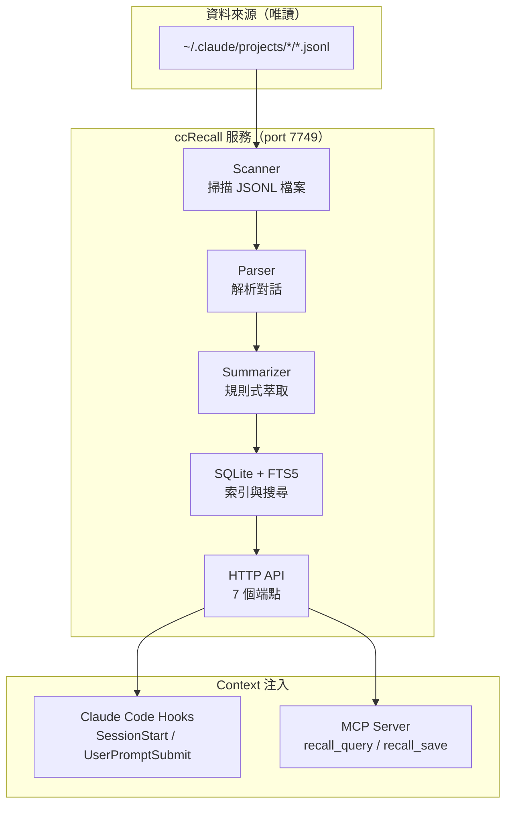

# ccRecall

[](https://opensource.org/licenses/MIT)
[](https://www.typescriptlang.org/)
[](https://nodejs.org/)
[](https://www.sqlite.org/)

[English](README.md)

Claude Code 的本地記憶服務——索引你的對話歷史，按需召回相關 context，注入到未來的 session。零 API 成本。

---

## 核心概念

每次開一個新的 Claude Code session，AI 就完全失憶。花 20 分鐘講清楚的架構、一起 debug 的那個 bug、做過的決策——全部歸零，下次重來。

CLAUDE.md 和 RESUME.md 能幫忙，但它們是你手動維護的靜態檔案。ccRecall 把這件事自動化：讀取 JSONL 對話記錄、建立可搜尋的索引、透過 hooks 和 MCP 工具把相關記憶回傳給 Claude Code。AI 自己記住學過的東西——你不用再提醒它。

ccRecall 是 [ccRewind](https://github.com/user/ccRewind)（對話回放 GUI）的「記憶」對應。ccRewind 讓人回頭看發生了什麼；ccRecall 讓 AI 記住發生了什麼。

---

## 功能特色

| 功能 | 說明 |
|------|------|
| **規則式摘要引擎** | 從 session 中提取意圖、動作、結果、標籤——不呼叫 LLM，零 API 成本 |
| **FTS5 全文搜尋** | 所有對話歷史的關鍵詞搜尋 <100ms，快到可以在 hook 中注入 |
| **增量索引** | 只重新索引有變動的 session（mtime 比對），透過 UUID 去重處理接續 session |
| **元認知** | 知識地圖追蹤 AI 探索過什麼主題、探索多深、信心多高 |
| **遺忘曲線** | 記憶隨時間壓縮：原始→摘要→一行結論→刪除。未使用的記憶信心衰減 |
| **純唯讀** | 絕不修改 `~/.claude/`——只讀取 JSONL 記錄 |

---

## 架構



---

## 技術棧

| 技術 | 用途 | 備註 |
|------|------|------|
| Node.js 22 + TypeScript | 執行環境 | ES modules、strict mode |
| better-sqlite3 | 資料庫 | 同步 API、零外部依賴 |
| FTS5 | 全文搜尋 | SQLite 內建、unicode61 tokenizer |
| 原生 `http` | HTTP 伺服器 | 不用 Express——最小表面積、僅 localhost |
| vitest | 測試 | 154 個測試、整合式風格 |

---

## 快速開始

### 環境需求

- Node.js 20+（建議 22）
- pnpm

### 安裝

```bash
git clone https://github.com/user/ccRecall.git
cd ccRecall

pnpm install

# 啟動開發伺服器（啟動時自動索引）
pnpm dev
```

服務啟動在 `http://127.0.0.1:7749`，會自動索引 `~/.claude/projects/` 下所有 JSONL 檔案。

### 驗證

```bash
# 健康檢查——sessionCount 應該 > 0
curl http://127.0.0.1:7749/health

# 搜尋你的對話歷史
curl "http://127.0.0.1:7749/memory/query?q=authentication&limit=5"
```

---

## API 端點

| 端點 | 方法 | 說明 | 狀態 |
|------|------|------|------|
| `/health` | GET | 服務健康 + DB 統計 | 已上線 |
| `/memory/query?q=...&limit=...` | GET | FTS5 跨 session 搜尋 | 已上線 |
| `/memory/context?session_id=...` | GET | Session context 查詢 | Stub |
| `/metacognition/check?topic=...` | GET | 知識深度檢查 | Stub |
| `/memory/save` | POST | 儲存記憶條目 | Stub |
| `/session/checkpoint` | POST | Pre-compact 存檔點 | Stub |
| `/session/end` | POST | Session 結束 hook | Stub |

---

## 專案結構

```
ccRecall/
├── src/
│   ├── core/
│   │   ├── types.ts         # 所有型別定義
│   │   ├── parser.ts         # JSONL 對話解析
│   │   ├── scanner.ts        # 檔案系統掃描
│   │   ├── summarizer.ts     # 規則式 session 摘要
│   │   ├── database.ts       # SQLite + FTS5（從 ccRewind 裁剪）
│   │   ├── indexer.ts        # 索引 pipeline 調度
│   │   └── index.ts          # Barrel exports
│   ├── api/
│   │   ├── server.ts         # HTTP 伺服器
│   │   └── routes.ts         # 請求路由
│   └── index.ts              # 入口
├── tests/
│   ├── fixtures/             # 測試用 JSONL 檔案
│   ├── parser.test.ts
│   ├── scanner.test.ts
│   ├── summarizer.test.ts
│   ├── database.test.ts
│   ├── indexer.test.ts
│   └── e2e.test.ts
└── .claude/
    └── pi-research/          # 架構研究文件
```

---

## 相關專案

- **[ccRewind](https://github.com/user/ccRewind)** — Claude Code 的 session 回放 GUI。ccRecall 的核心模組（parser, scanner, summarizer, database, indexer）從 ccRewind 抽取而來。

---

## 隨想

### 為什麼做這個

Anthropic Claude Code 團隊的 Thariq 在 2026 年 4 月[發表了 context 管理的文章](https://x.com/trq212)——11,908 個書籤，因為大家存起來反覆看但沒人有工具做到。他把問題講得很精準：context rot 讓長 session 的模型表現退化，autocompact 在最爛的時機觸發。

但他給了方法論，沒給工具。ccRecall 就是那個工具。

真正的觸發點更簡單：我受夠了每次跨 session 都要重新跟 Claude Code 解釋同一個架構。不是 AI 記性差——它根本不能記。每個 session 從零開始。CLAUDE.md 能幫忙，但它是我手動維護的靜態檔案。維護成本的增長速度超過知識的增值速度。聽起來很熟？這正是人類放棄 wiki 的原因（Karpathy 的 LLM Wiki 洞見）。

### 設計抉擇

**規則式摘要引擎而非 LLM 呼叫。** claude-mem 用 Claude API 做摘要——花 AI 的錢幫 AI 記東西。ccRecall 用 heuristic 萃取（regex 模式、工具使用分析、outcome 推斷）。沒有 LLM 精緻，但成本精確歸零。對 session 摘要來說，「Edit×8, 5 files, committed」比一段文字更有用。

**FTS5 而非向量資料庫。** 語義搜尋聽起來更高級，但對話記錄搜尋的是具體的工具名、檔案路徑、錯誤訊息——關鍵詞匹配就夠了。FTS5 查詢在本地 <10ms。不需要 embedding model、不需要 Chroma、不需要 Docker container。在我們的規模（數百個 session，不是百萬文件），Karpathy 自己的分析也確認：「500 個來源以下，樸素索引 + 關鍵詞搜尋已經夠用。」

**HTTP + MCP 雙介面。** 研究顯示 MCP server tools 是注入 context 到 Claude 最穩定的方式（pull-based，Claude 決定何時取）。但 SessionStart hooks（push-based，自動注入）也穩定。所以 ccRecall 兩個都跑：HTTP 給 hooks 用，MCP 給按需查詢。同一個 SQLite 後端，兩種存取模式。

**唯讀約束。** ccRecall 絕不修改 `~/.claude/`。這不只是禮貌——是信任邊界。如果一個背景服務能寫入你的 Claude Code 設定，一個 bug 就可能毀掉你的 session。唯讀意味著最壞情況是「ccRecall 搜尋結果不好」，不是「ccRecall 搞壞了我的設定」。

### 刻意不做的事

**不用 Docker、不用 Electron、不用向量資料庫。** 這些是刻意排除，不是缺失的功能。Docker 對一個 `pnpm dev` 就能跑的東西增加了部署摩擦。Electron 是給 GUI 用的——ccRecall 沒有 UI（那是 ccRewind 的事）。向量資料庫解決的是我們在這個規模不存在的問題。

**任何操作都不依賴 LLM。** 如果 ccRecall 需要 API key 才能運作，它就失敗了。核心就是零成本、本地運行的記憶。摘要是規則式的，搜尋是 FTS5。需要 LLM 呼叫的那天，就是我們 overscope 的那天。

**不做「智慧」記憶注入。** ccRecall 不替 Claude 決定該記住什麼。它提供搜尋 API——注入層（hooks、MCP）呈現結果，Claude 自己整合。帶偏見的記憶篩選是過早優化，而且會以我們無法預測的方式出錯。

**不修改使用者資料。** ccRecall 讀取 `~/.claude/projects/` 的 JSONL 檔案。它絕不寫入那個目錄、絕不修改 session 檔案、絕不自動把自己注入 Claude Code 的設定。使用者自己決定設定 hooks 和 MCP——ccRecall 不會自己安裝自己。

---

## 授權

本專案使用 [MIT](LICENSE) 授權。

---

## 作者

tznthou - [tznthou@gmail.com](mailto:tznthou@gmail.com)
