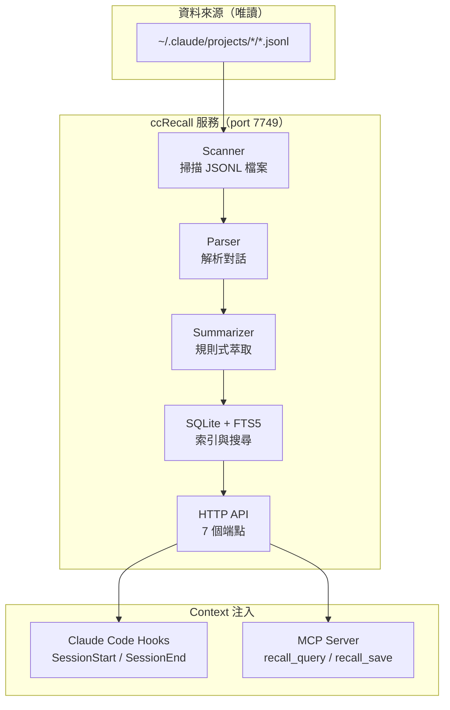

# ccRecall

[](https://opensource.org/licenses/Apache-2.0)
[](https://www.typescriptlang.org/)
[](https://nodejs.org/)
[](https://www.sqlite.org/)

[English](README.md)

Claude Code 的本地記憶服務——索引你的對話歷史，按需召回相關 context，注入到未來的 session。零 API 成本。

---

## 核心概念

每次開一個新的 Claude Code session，AI 就完全失憶。花 20 分鐘講清楚的架構、一起 debug 的那個 bug、做過的決策——全部歸零，下次重來。

CLAUDE.md 和 RESUME.md 能幫忙，但它們是你手動維護的靜態檔案。ccRecall 把這件事自動化：讀取 JSONL 對話記錄、建立可搜尋的索引、透過 hooks 和 MCP 工具把相關記憶回傳給 Claude Code。AI 自己記住學過的東西——你不用再提醒它。

ccRecall 是 [ccRewind](https://github.com/tznthou/ccRewind)（對話回放 GUI）的「記憶」對應。ccRewind 讓人回頭看發生了什麼；ccRecall 讓 AI 記住發生了什麼。

> **命名說明**：本專案與 [spences10/ccrecall](https://github.com/spences10/ccrecall)（一個 analytics 導向的工具，恰好同名）無關。由於 npm 上 `ccrecall` 已被佔用，我們以 `@tznthou/ccrecall` 發佈，CLI 命令名為 `ccmem`。

---

## 功能特色

| 功能 | 說明 |
|------|------|
| **規則式摘要引擎** | 從 session 中提取意圖、動作、結果、標籤——不呼叫 LLM，零 API 成本 |
| **FTS5 全文搜尋** | 所有對話歷史的關鍵詞搜尋 <100ms，快到可以在 hook 中注入 |
| **增量索引** | 只重新索引有變動的 session（mtime 比對），透過 UUID 去重處理接續 session |
| **元認知** | `knowledge_map` 聚合 session + memory 的主題提及。由 mention count 衍生深度（shallow / medium / deep）。透過 `/metacognition/check` 與 MCP `recall_context` 暴露 |
| **遺忘曲線** | 記憶隨時間壓縮：原始→摘要→一行結論→刪除。未使用的記憶信心衰減。背景維護 tick 每 5 分鐘跑一次 |
| **Watch mode** | 基於 chokidar 的 JSONL watcher 在 2 秒內偵測新 session；每 10 分鐘 full-resync 補救 FS 事件漏接 |
| **Rescue reindex** | `/session/end` 遇到 cache miss 時會重 index 再試一次——hook 和 daemon 間不會有 fresh-session race |
| **macOS 自動啟動** | `ccmem install-daemon` 安裝 LaunchAgent，重開機自動復原服務 |
| **純唯讀** | 絕不修改 `~/.claude/`——只讀取 JSONL 記錄 |

---

## 架構



---

## 技術棧

| 技術 | 用途 | 備註 |
|------|------|------|
| Node.js 20–22 + TypeScript | 執行環境 | ES modules、strict mode |
| better-sqlite3 | 資料庫 | 同步 API、零外部依賴 |
| FTS5 | 全文搜尋 | SQLite 內建、unicode61 tokenizer |
| 原生 `http` | HTTP 伺服器 | 不用 Express——最小表面積、僅 localhost |
| chokidar | 檔案系統 watcher | 跨平台 JSONL 變動偵測，2 秒 debounce + single-flight |
| vitest | 測試 | 396 個測試（26 檔案）、整合式風格 |
| `@modelcontextprotocol/sdk` | MCP server | stdio transport，透過 WAL 共用 SQLite |

---

## 快速開始

> **第一次來？** 完整教學（npm 安裝 → MCP 設定 → 日常使用）在 [`docs/tutorial_zh.md`](docs/tutorial_zh.md)。下方是 contributor / 開發模式路徑。

### 環境需求

- Node.js `>=20.0.0,<23.0.0`
- pnpm

### 安裝

```bash
git clone https://github.com/tznthou/ccRecall.git
cd ccRecall

pnpm install

# 啟動開發伺服器（啟動時自動索引，並 watch ~/.claude/projects）
pnpm dev
```

服務啟動在 `http://127.0.0.1:7749`，會自動索引 `~/.claude/projects/` 下所有 JSONL 檔案。

### 驗證

```bash
# 健康檢查——sessionCount 應該 > 0
curl http://127.0.0.1:7749/health

# 搜尋你的對話歷史
curl "http://127.0.0.1:7749/memory/query?q=authentication&limit=5"
```

---

## API 端點

| 端點 | 方法 | 說明 | 狀態 |
|------|------|------|------|
| `/health` | GET | 服務健康 + DB 統計 + integrity 檢查狀態 | 已上線 |
| `/memory/query?q=...&limit=...&project=...` | GET | FTS5 跨 session 搜尋，可選 project 過濾 | 已上線 |
| `/memory/save` | POST | 儲存記憶條目（Origin 驗證） | 已上線 |
| `/session/end` | POST | 從結束的 session 萃取記憶（idempotent） | 已上線 |
| `/memory/context?session_id=...` | GET | Session context 查詢 | Stub |
| `/metacognition/check?projectId=...[&topic=...]` | GET | 知識地圖：summary（top/recent/stale topics + counts）或 topic detail（memories + related topics） | 已上線 |
| `/session/checkpoint` | POST | 會話中途快照寫入獨立 `session_checkpoints` 表（不會被 harvest 成 memory） | 已上線 |
| `/lint/warnings` | GET | Lint 報告：orphan（session 已刪）+ stale（低信心、長期未用）記憶警告 | 已上線 |

## MCP 工具

| 工具 | 用途 |
|------|------|
| `recall_query` | 純 FTS5 關鍵字搜尋 memories |
| `recall_context` | 按 topic 分組的檢索——normalize keywords、依匹配 topic 分組 memories 並附 depth 訊號，無 topic 匹配時退回 per-keyword FTS |
| `recall_save` | 儲存新記憶（type：decision / discovery / preference / pattern / feedback） |

**Memory types**（用於 `recall_save`）：

- `decision`（決策）— 有理由的明確選擇
- `discovery`（發現）— 非顯而易見的洞察
- `preference`（偏好）— 使用者風格或慣例
- `pattern`（模式）— 反覆出現的流程或程式碼範本
- `feedback`（回饋）— 使用者對過往工作的修正

註冊到 Claude Code。`pnpm build` 後 `dist/mcp/server.js` 就是可執行的 MCP server：

```bash
# 用 build 出的 bin（pnpm build 之後）
claude mcp add ccrecall --scope user -- /absolute/path/to/ccRecall/dist/mcp/server.js

# 或開發時用 tsx 不經 build
claude mcp add ccrecall --scope user -- /absolute/path/to/ccRecall/node_modules/.bin/tsx /absolute/path/to/ccRecall/src/mcp/server.ts
```

可直接複製的範本：[.mcp.json.example](.mcp.json.example)。

SessionStart / SessionEnd hook 安裝見 [hooks/README.md](hooks/README.md)。

---

## ccRecall 與 auto memory 的分工

ccRecall 和 Claude Code 內建的 auto memory（`~/.claude/projects/*/memory/`）是互補關係，各司其職，不要混用。

|  | auto memory | ccRecall |
|---|---|---|
| **寫入路徑** | Claude 手動策展——新開一個 `.md` 檔 + 更新 MEMORY.md index | 自動化：SessionEnd hook 把整個 session 萃取進資料庫 |
| **讀取路徑** | 永遠在 session context（MEMORY.md 啟動時就載入） | auto memory 沒答案時，才用 MCP 查詢 |
| **訊號密度** | 高——值得被命名的決策和偏好 | 長尾——hook 能抓到的都留著 |
| **適用情境** | 「記住 X」「以後都 Y」——重要偏好、明確決策 | 「上次那個怎麼修的？」——跨多個 session 的回憶 |

**寫入預設：存 auto memory，ccRecall 讓 hook 自己抓就好。** 不要 auto memory 寫完一份、又呼叫 `recall_save` 複寫一次——雙寫只會製造噪音。

**查詢預設：MEMORY.md 已經在 context 裡，先看 index 有沒有。** auto memory 沒答案，才 fallback 到 `recall_query` / `recall_context`。

ccRecall 的價值在長尾——幾百個 session 不可能全手工整理。如果 Claude 兩邊都試，auto memory 永遠會贏（本來就在 context 裡而且已經被策展）。ccRecall 存在的意義是：策展索引漏掉時，長尾那堆還在資料庫裡可以撈出來。

---

## 作為服務運行（macOS）

ccRecall 是本地 HTTP daemon。要重開機也維持運行，註冊 per-user LaunchAgent：

```bash
pnpm build
node dist/index.js install-daemon        # 或 `ccmem install-daemon`（若已全域 link）
node dist/index.js install-daemon --dry-run   # 預覽 plist 不寫檔

# 驗證
launchctl list | grep ccrecall
curl http://127.0.0.1:7749/health

# 移除
node dist/index.js uninstall-daemon
```

installer 的行為：
- 寫入 `~/Library/LaunchAgents/com.tznthou.ccrecall.plist`
- log 路由到 `~/Library/Logs/ccrecall/ccrecall.{out,err}.log`
- 從當前 shell 的 `CCRECALL_PORT` / `CCRECALL_DB_PATH` 寫入 plist，確保
  LaunchAgent 用和你互動執行時一致的設定
- 拒絕覆蓋 `Label` 不匹配的 plist（安全檢查）

完整手動安裝、troubleshooting、uninstall 文件：[docs/launchd.md](docs/launchd.md)。

Linux/Windows 對應版本（systemd unit、Windows service）列在 Phase 5。目前
Linux 可用 `nohup` 或自選 process manager。

---

## 監控

daemon 啟動時跑一次 `PRAGMA integrity_check`，之後每 6 小時重跑。結果
（timestamp + 布林值）會 cache 並透過 `/health` 的 `lastIntegrityCheckAt`
／ `lastIntegrityCheckOk` 欄位回報。偵測到 drift 時，完整 `integrity_check`
輸出會寫入 `~/.ccrecall/integrity-alerts/` 下含時間戳的檔案。

收到 drift alert 時，**先 snapshot DB，再執行 REINDEX**。REINDEX 修症狀但
抹掉現場：

```bash
cp ~/.ccrecall/ccrecall.db ~/ccrecall-drift-snapshot.db
sqlite3 ~/.ccrecall/ccrecall.db 'REINDEX;'
```

---

## 專案結構

```
ccRecall/
├── src/
│   ├── core/
│   │   ├── types.ts                  # 所有型別定義
│   │   ├── parser.ts                 # JSONL 對話解析
│   │   ├── scanner.ts                # 檔案系統掃描
│   │   ├── summarizer.ts             # 規則式 session 摘要
│   │   ├── topic-extractor.ts        # 規則式 topic 抽取
│   │   ├── database.ts               # SQLite + FTS5(從 ccRewind 裁剪)
│   │   ├── indexer.ts                # 索引 pipeline 調度
│   │   ├── memory-service.ts         # 記憶生命週期(touch / delete / update)
│   │   ├── compression.ts            # L0→L1→L2→delete 狀態機
│   │   ├── lint.ts                   # Orphan / stale 記憶偵測
│   │   ├── maintenance-coordinator.ts # 背景壓縮 tick
│   │   ├── watcher.ts                # chokidar JSONL watcher(Phase 4e)
│   │   └── log-safe.ts               # scrubErrorMessage — log-injection 防護
│   ├── api/
│   │   ├── server.ts                 # HTTP 伺服器
│   │   └── routes.ts                 # 路由 + rescue reindex
│   ├── mcp/
│   │   ├── server.ts                 # MCP stdio server 入口(含 shebang)
│   │   └── tools.ts                  # recall_query + recall_context + recall_save
│   ├── cli/
│   │   └── daemon.ts                 # install-daemon / uninstall-daemon(macOS)
│   └── index.ts                      # HTTP 入口 + 子指令分派
├── hooks/
│   ├── session-start.mjs             # SessionStart 注入記憶(stdout)
│   ├── session-end.mjs               # SessionEnd 呼叫 /session/end
│   └── README.md                     # Hook 安裝指南
├── docs/
│   ├── tutorial_zh.md                # 使用者教學（安裝 → MCP → 日常使用）
│   ├── architecture_zh.md            # Daemon 設計取捨（給 contributor 看）
│   └── launchd.md                    # macOS LaunchAgent 安裝/troubleshoot
├── tests/                            # 396 個測試橫跨 26 檔案(parser /
│   │                                 # scanner / summarizer / database /
│   │                                 # indexer / e2e / memories / mcp /
│   │                                 # session-end / compression / lint /
│   │                                 # watcher / bin-smoke / cli-daemon /
│   │                                 # migration-v18 / decay /
│   │                                 # maintenance-coordinator / memory-service /
│   │                                 # memory-project-scope / touch /
│   │                                 # hooks-session-start / hooks-session-end /
│   │                                 # knowledge-map / topic-extractor /
│   │                                 # metacognition / session-checkpoint)
│   └── fixtures/                     # 測試用 JSONL + 共用 helpers
├── .mcp.json.example                 # MCP client 設定範本
├── NOTICE / SECURITY.md / CONTRIBUTING.md / CODE_OF_CONDUCT.md
└── .claude/
    └── pi-research/                  # 架構研究文件
```

---

## 相關專案

- **[ccRewind](https://github.com/tznthou/ccRewind)** — Claude Code 的 session 回放 GUI。ccRecall 的核心模組（parser, scanner, summarizer, database, indexer）從 ccRewind 抽取而來。

---

## 隨想

### 為什麼做這個

Anthropic Claude Code 團隊的 Thariq 在 2026 年 4 月[發表了 context 管理的文章](https://x.com/trq212)——11,908 個書籤，因為大家存起來反覆看但沒人有工具做到。他把問題講得很精準：context rot 讓長 session 的模型表現退化，autocompact 在最爛的時機觸發。

但他給了方法論，沒給工具。ccRecall 就是那個工具。

真正的觸發點更簡單：我受夠了每次跨 session 都要重新跟 Claude Code 解釋同一個架構。不是 AI 記性差——它根本不能記。每個 session 從零開始。CLAUDE.md 能幫忙，但它是我手動維護的靜態檔案。維護成本的增長速度超過知識的增值速度。聽起來很熟？這正是人類放棄 wiki 的原因（Karpathy 的 LLM Wiki 洞見）。

### 設計抉擇

**規則式摘要引擎而非 LLM 呼叫。** claude-mem 用 Claude API 做摘要——花 AI 的錢幫 AI 記東西。ccRecall 用 heuristic 萃取（regex 模式、工具使用分析、outcome 推斷）。沒有 LLM 精緻，但成本精確歸零。對 session 摘要來說，「Edit×8, 5 files, committed」比一段文字更有用。

**FTS5 而非向量資料庫。** 語義搜尋聽起來更高級，但對話記錄搜尋的是具體的工具名、檔案路徑、錯誤訊息——關鍵詞匹配就夠了。FTS5 查詢在本地 <10ms。不需要 embedding model、不需要 Chroma、不需要 Docker container。在我們的規模（數百個 session，不是百萬文件），Karpathy 自己的分析也確認：「500 個來源以下，樸素索引 + 關鍵詞搜尋已經夠用。」

**HTTP + MCP 雙介面。** 研究顯示 MCP server tools 是注入 context 到 Claude 最穩定的方式（pull-based，Claude 決定何時取）。但 SessionStart hooks（push-based，自動注入）也穩定。所以 ccRecall 兩個都跑：HTTP 給 hooks 用，MCP 給按需查詢。同一個 SQLite 後端，兩種存取模式。

**唯讀約束。** ccRecall 絕不修改 `~/.claude/`。這不只是禮貌——是信任邊界。如果一個背景服務能寫入你的 Claude Code 設定，一個 bug 就可能毀掉你的 session。唯讀意味著最壞情況是「ccRecall 搜尋結果不好」，不是「ccRecall 搞壞了我的設定」。

### 刻意不做的事

**不用 Docker、不用 Electron、不用向量資料庫。** 這些是刻意排除，不是缺失的功能。Docker 對一個 `pnpm dev` 就能跑的東西增加了部署摩擦。Electron 是給 GUI 用的——ccRecall 沒有 UI（那是 ccRewind 的事）。向量資料庫解決的是我們在這個規模不存在的問題。

**任何操作都不依賴 LLM。** 如果 ccRecall 需要 API key 才能運作，它就失敗了。核心就是零成本、本地運行的記憶。摘要是規則式的，搜尋是 FTS5。需要 LLM 呼叫的那天，就是我們 overscope 的那天。

**不做「智慧」記憶注入。** ccRecall 不替 Claude 決定該記住什麼。它提供搜尋 API——注入層（hooks、MCP）呈現結果，Claude 自己整合。帶偏見的記憶篩選是過早優化，而且會以我們無法預測的方式出錯。

**不修改使用者資料。** ccRecall 讀取 `~/.claude/projects/` 的 JSONL 檔案。它絕不寫入那個目錄、絕不修改 session 檔案、絕不自動把自己注入 Claude Code 的設定。使用者自己決定設定 hooks 和 MCP——ccRecall 不會自己安裝自己。

---

## 變更記錄

版本更新與歷程記錄在 [CHANGELOG_ZH.md](CHANGELOG_ZH.md)。每個 tag 都有對應條目；`Unreleased` 段是已進 `main`、尚未發 npm 的改動。

---

## 授權

本專案使用 Apache License 2.0 授權 —— 見 [LICENSE](LICENSE)。

Copyright 2026 tznthou

---

## 作者

tznthou — [tznthou.com](https://tznthou.com) · [tznthou@gmail.com](mailto:tznthou@gmail.com)
